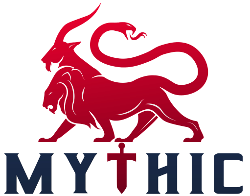

<h3> Mythic Agents Organization</h3>

The `MythicAgents` organization contains repositories from the community and <a href="https://github.com/SpecterOps">SpecterOps</a> with agents that can be installed in <a href="https://github.com/its-a-feature/Mythic">Mythic</a>.
Any of these agents can be installed via `sudo ./mythic-cli install github [agent repo]`.

* [Community Overview](https://mythicmeta.github.io/overview/)
* [Agent Capabilities Matrix](https://mythicmeta.github.io/overview/agent_matrix.html)
* [PyPi/Golang packages/source code](https://github.com/MythicMeta)
* [Mythic](https://github.com/its-a-feature/Mythic)